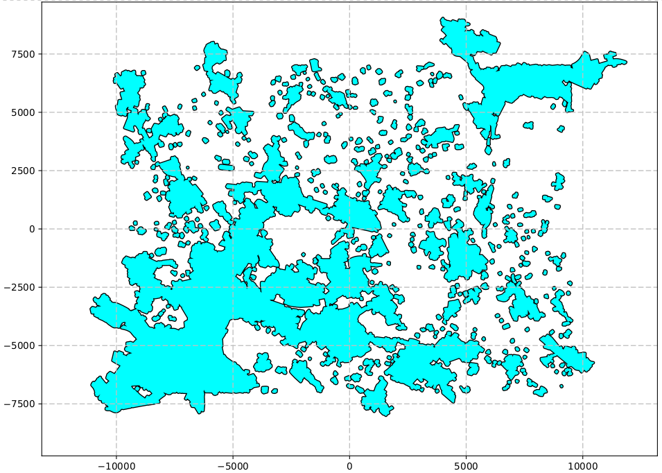
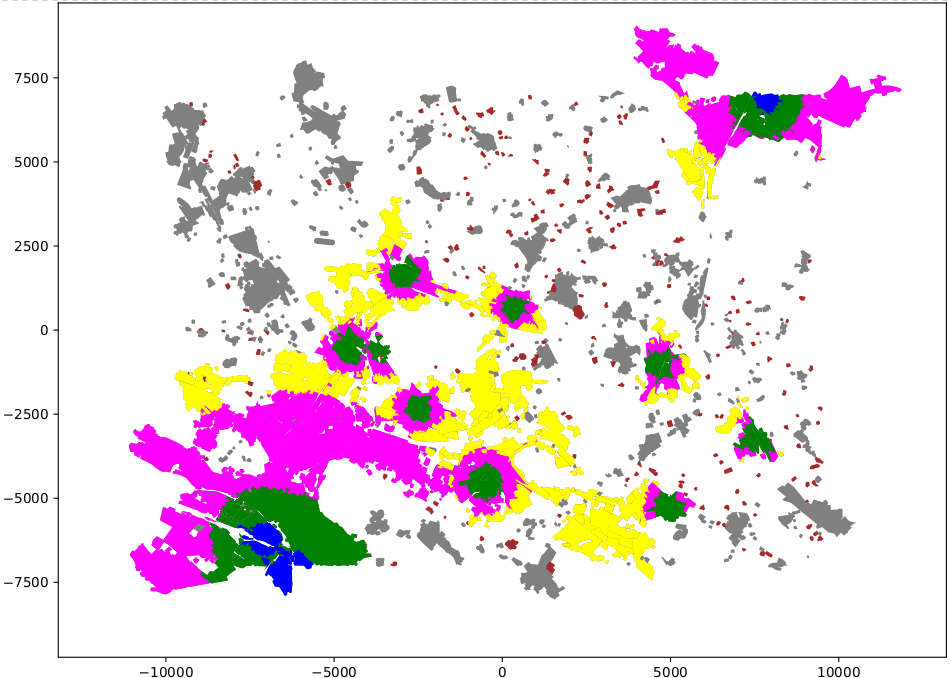
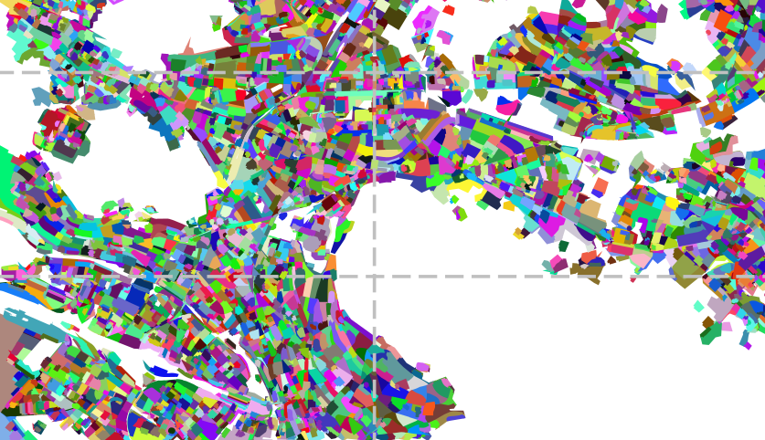
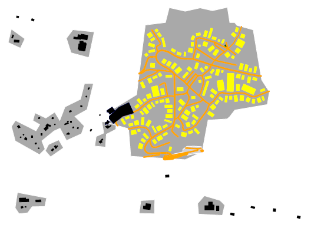
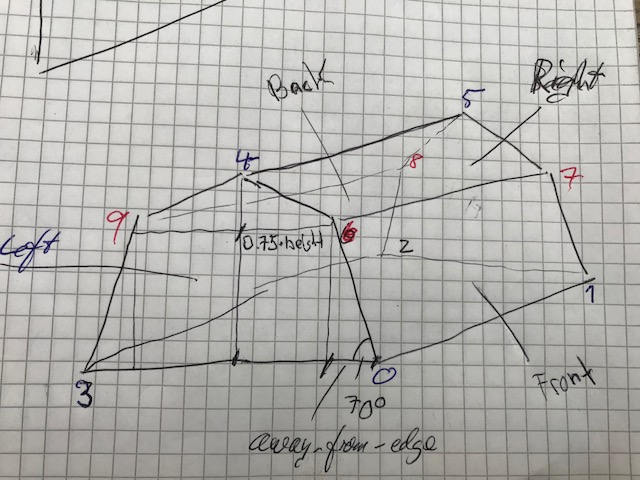
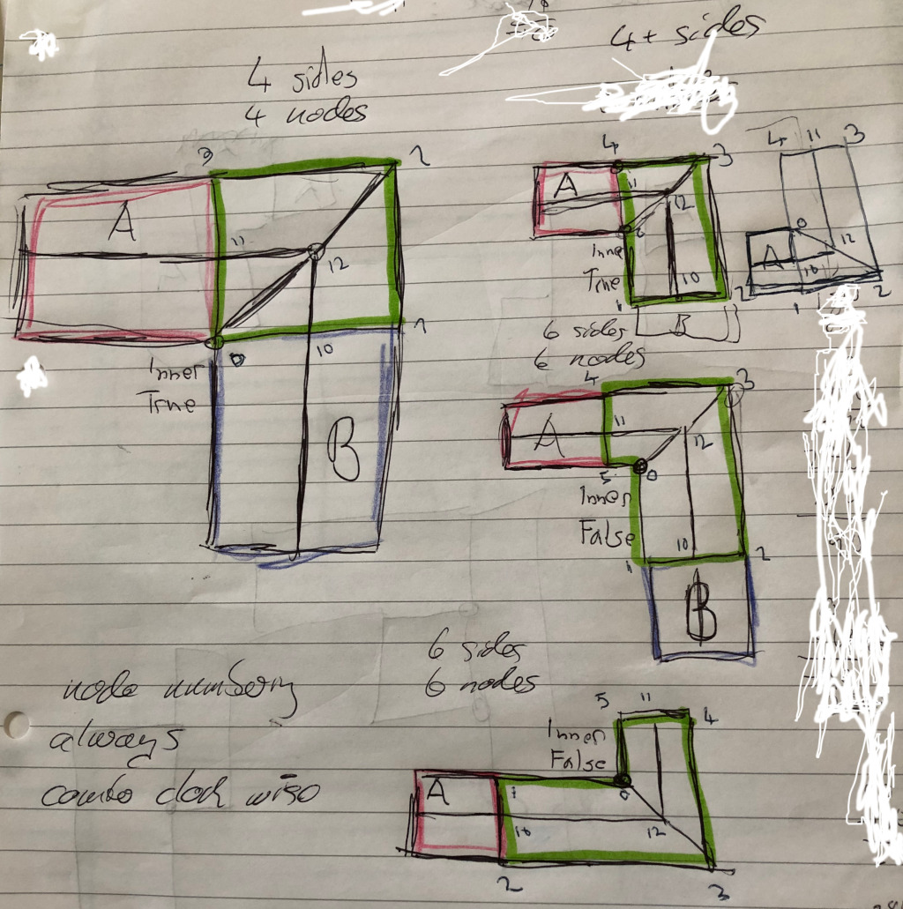

.. _chapter-howitworks-label:

##################
How osm2city Works
##################

``osm2city`` is a set of procedural programs, which together create plausible FlightGear scenery objects (buildings, roads, power lines, piers, platforms etc.) based on OpenStreetMap_ (OSM) data as well as data already existing in the default FlightGear `World Scenery`_.

``Plausible`` means here that the generated scenery should look in a way that a person not knowing the details of a specific location could believe that reality actually looks like that. Or that a person knowing the location would find a fair representation of landmarks and dimensions to find her / his way around in the virtual world.

This plausible world is achieved tried to be achieved by using `heuristics`_ to interpret the data input and combine it with a set of :ref:`parameters <chapter-parameters-label>` as well as some randomness.

FlightGear and its World Scenery represent almost any location in our world. ``osm2city`` attempts to support this. Instead of a set of artists and programmers developing a specific scenery in a confined part of the world, which often means putting a considerable amount of hand-made objects into the scenery and tweaking stuff manually, ``osm2city`` uses generic heuristics, models, textures etc. and applies them to any part of the world with some parametrisation. This makes the task to cover the world a bit easier, but of course can only mimic the real world so much.

And then there are two twists to what is stated in the previous paragraph:

* The scenery generated by ``osm2city`` respects the static objects put into the default scenery by diverse FlightGear scenery developers around the world — especially airports and landmarks like bridges, worship buildings etc. (see also the `FlightGear Scenery Website`_ and the `Map over Scenery Models`_). I.e. the better the specific location is covered by manually created and placed static object, the closer to reality the combination with ``osm2city`` generated scenery objects might get.
* ``osm2city`` generated scenery is only as good as the underlying data. The higher the density and quality of the mapping done in OpenStreetMap, the better the scenery gets. In many parts of the world only a minor share of buildings is mapped at all. Often the only information available are floor plans and generic land-use zones — although the available `map features`_ in OSM are abundant and would allow for extreme sophistication (to be fair: this would then again require quite some sophistication in ``osm2city`` to consume). In some cities (especially Europe) mappers are using `Simple 3D Buildings`_, which results in nice representations in ``osm2city``, which can come close to hand-crafted models.

Remember: FlightGears default scenery is only using freely available (world-wide) data and related freely available scenery objects. And so is ``osm2city``. This data is often not as detailed as commercial products can provide.

==============
Specific Stuff
==============

Many features are explained in the :ref:`parameters <chapter-parameters-label>` section. The subchapters below give some additional details.

--------------------------------
Elevation and Detection of Water
--------------------------------

``osm2city`` generated scenery must play nicely with the default FlightGear scenery. This principle is also true if ``osm2city`` has access to better data in e.g. OSM.

Height above sea level is taken from the FlightGear scenery through some built in functionality in FlightGear (``fgelev``).

The FlightGear scenery is also used to determine, where there is water (the land-use information in FlightGear does sometimes deviate considerably from OSM — up to tens of meters). If ``PROBE_FOR_WATER`` is set to True, then buildings and roads are as far as possible not placed into water.

.. _chapter-howto-land-use-label:

-----------------
Land-use Handling
-----------------

Land-use processing is a bit intricate, because OSM data is often insufficient or even lacking. Also for building heuristics it is necessary to have some idea about whether a built-up area is close to a centre and/or the type of settlement (e.g. village vs. town).

To understand the following it is important to first read chapter about :ref:`Land-use <chapter-parameters-landuse-label>` parameters.

Once the land-use zone for built-up areas are read from OSM and/or generated (called "building_zones" in the code), lit areas are created by buffering all building zones and then merging as far as possible. These lit areas are not only used to determine, which streets should be lit, but are also used as a settlement clusters for cities and towns.

Only settlement areas tagged in OSM with ``place=city`` or ``place=town`` are considered for further processing of built-up areas, where apartments etc. exist. This is because the rural types are used as default, ``place=farm`` is treated specially and values for ``place`` like ``quarter``, ``suburb``, ``neighbourhood`` do not provide extra information. For ``city`` and ``town`` feature types Node, Way and Relation are read from OSM for ``key=place``, however Way and Relation are reduced to a node by using the area's centroid. Note that a pre-requisite for this to work is that the mapping in OSM has been done as instructed in `Key Place`_.

In a first step all city or town places are linked to lit areas extended with specific water areas [#water]_. Then the zones are split into city_block objects, i.e. areas surrounded by streets — some of the polygons will be real city blocks, others will be border areas (the "city" part is not really true here - even a hamlet could in osm2city get divided into several city_blocks). The city blocks take over the land-use type (type can be ``non-osm`` if generated and therefore without real meaning).

Finally depending on the place type and the distance to the centroid a given city block has, it is assigned one of the following settlement types:

* ``centre``: the centre of a city (not available for towns). Max distance = population^(1/2)
* ``block``: an area in the center of a city, where streets define blocks, and the buildings within the blocks most often are apartment like buildings, where the facades are aligned with the street and most often buildings are connected. Max distance = population^(5/8).
* ``dense``: an area with dense population mostly living in apartments, but the apartment houses are not necessarily connected. Max distance = population^(2/3).
* ``periphery``: an area with mostly (detached) houses. Outside of max distance for ``dense``, but inside the boundaries of a settlement cluster for city/town (i.e. anything not centre/block or dense inside a settlement cluster is by default periphery).

There is also settlement type ``rural``, which is the default for all those building zones, which re not within a lit area that is linked to a city or town place. In theory the main difference between ``periphery`` and ``rural`` is the ratio between a property's lot size and the floor plan, where in rural regions the same family house size typically has more surrounding ground.

Please be aware that there is no "science" behind the chosen concentric ring radii and the settlement types. It is just a heuristic / an observation that the farther away from the city centre you get, the less dense the area. Also the settlement area is "some" function of the population (and the commuting workers into a city/town from outside are neglected). Also in some areas of the world densities are higher. This can be corrected with a linear parameter. The population is taken as is from OSM - if missing a parametrised default population is used.

The following table shows the resulting radii in metres for some example population sizes:

=====    ==========    ======    =====    ======
Place    Population    Centre    Block    Dense
=====    ==========    ======    =====    ======
Town     10 000        n/a       316      464
Town     50 000        n/a       864      1357
City     100 000       316       1334     2154
City     200 000       447       2056     3419
City     1 000 000     1000      5623     10000
=====    ==========    ======    =====    ======

I.e. all city blocks linked to building zones are tested against these circles and if intersecting/within, then the most "centric" one is linked to the city block. The building zone gets the maximum settlement type of all related city blocks.

The following plots illustrate this around tile with 3088986 LSZH, where in most plots the city centre of Zurich is in the lower left corner and the smaller city of Winterthur is in the upper right corner.

Lit areas:

Settlement types (blue: centre, green: block, magenta: dense, yellow: periphery, grey: rural, brown: farmyard)

Pattern of city blocks:

.. [#water] In cities like Copenhagen, Prague, Amsterdam, New York etc. larger water areas split the city. And that would make it look like the zones on the other side of the water area are not part of the city anymore. To make sure that this is still the case OSM data for water areas (``river``, ``canal``, ``moat`` and ``riverbank``) are added to the clustering to simulate continuous city areas.

.. _chapter-howto-generate-would-be-buildings-label:

---------------------------
Generate Would-Be Buildings
---------------------------
This is the core operation of the OWBB library. It generates buildings at probable places based on land-use zones, existing buildings and a set of parameters. At the core of the algorithm all streets within land-use zones are followed and to the left and right spots are searched for, where there would be place for an additional building — the building type being a function of the land-use zone, other buildings, street type and a set of parameters.

As an example the following picture shows generated buildings (yellow) based on land-use zones as defined in the previous chapter.

-----
Roofs
-----

The following are some pointers to how roofs work, and in particular code in roofs.py.

.......
Gambrel
.......
Node numbering for ``gambrel`` roof type:

.. _OpenStreetMap: https://www.openstreetmap.org/
.. _World Scenery: http://wiki.flightgear.org/World_Scenery
.. _heuristics: https://en.wikipedia.org/wiki/Heuristic
.. _FlightGear Scenery Website: https://scenery.flightgear.org/
.. _Map over Scenery Models: https://scenery.flightgear.org/map/
.. _map features: https://wiki.openstreetmap.org/wiki/Map_Features
.. _Simple 3D Buildings: https://wiki.openstreetmap.org/wiki/Simple_3D_buildings
.. _Place: https://wiki.openstreetmap.org/wiki/Places
.. _Key Place: https://wiki.openstreetmap.org/wiki/Key:place

..................
Gabled Around Edge
..................

There are three situations, where a gabled roof around an edge is done. See also class RoofHints in roofs.py:

* A 4-sided building with 4 nodes and 2 adjacent buildings share 1 common node with the building (if there is only one neighbour building or if the 2 neighbours are on each side, then a gabled roof is done).  If more than 2 neighbours we would not know what to do.
* A somewhat square-shaped building with 5 nodes and 5 sides, where the inner node is shared with a neighbour building. It is a requirement that the inner node is making an angle between 170 and 190 degrees with the previous/next node. Otherwise the roof just gets a skeleton roof.
* A L-shaped building with 6 nodes and 6 sides where the inner node is not shared with a neighbour building. If is a requirement that the inner node is making an angle between 80 and 100 degrees with the previous/next node. Otherwise the roof just gets a skeleton roof.

.. _chapter-aerodromes:

----------
Aerodromes
----------

Data for runways and helipads are depending on parameters read from the ``apt.dat files`` in ``$FG_ROOT/Airports/apt.dat.gz`` and under ``NavData/apt/`` in the scenery directories, or directly from btg-files. This information is used to avoid having crossing OSM roads to be visible and potentially creating a considerable bump when a plane rolls over.

Data for airport boundaries are also read from the ``apt.dat`` files (not all airports have information about boundaries). This data is then merged with OSM data for ``aeroway=aerodrome`` (again not all airports might be modelled with a zone). The resulting land-use is making sure that buildings within these zones will look more like airport buildings: using flat roofs (unless the roof type is explicitly modelled in OSM) and using a modern facade texture. Also: no buildings are generated inside zones for aerodromes.

-----
Trees
-----

In FG there are two ways trees are added: (a) based on land-class (e.g. woods) and (b) random trees based on a mask for land-classes (e.g. urban areas). osm2city enhances handling of trees by using OSM data for specifically mapped trees as well as by interpreting land-use data. osm2city "plants" trees as follows:

* Mapping from OSM: either as single node, as tree_lined=* or as natural=tree_row => ``significant-trees`` (in Western Europe that would most often be a deciduous tree)
* Trees based on specific OSM land-use (not woods) in urban areas (e.g. park): a mixture of ``garden-vegetation`` and ``significant-trees``
* Trees in built-up areas interpreted by osm2city: ``garden-vegetation``

osm2city calculates the position (incl. elevation) of each tree based on heuristics and based on knowledge of the geometry of buildings, streets and railroads. Trees are then combined into a text file for the STG-verb TREE_LIST. There is a clear performance advantage of having as few TREE_LISTs as possible. Therefore the needed materials and textures have been reduced to a set of two:

* ``garden-vegetation``: different types of shrubs and trees
* ``significant-trees``: one type of tree - the one most often seen in a specific region in avenues, parkways, along streets in the country side etc. These trees are typically much larger than trees in gardens, but also lower than their counterparts in woods, because in built-up areas they have less space to grow and along streets they typically do not have that much space to grow neither.

Using just randomly placed trees in a park is not satisfactory. Therefore, `Perlin noise <https://en.wikipedia.org/wiki/Perlin_noise>`_ is used to make it more natural looking - amongst others having areas without trees like in most parks. File ``osm2city-data\tex\perlin_noise_trees.png`` has been generated using the `Perlin Noise Maker <http://kitfox.com/projects/perlinNoiseMaker/>`_ web-app (width/height: 512; cell size: 128; levels: 2; attenuation:1; random seed 6). The image is tileable and can therefore be extended in each direction. 1 pixel is 1 metre. The grey tone is used to determine where there should be no trees (light grey) vs. garden vegetation (darker). NB: the pixel numbers are like follows: x-direction left-to-right as int (often called "s") and y-direction downwards (often called "t").

In order to have some variety in ``garden-vegetation``, the related texture has been expanded from default 8 to 16 (specified in ``tree-varieties`` within the material definition (cf. ca. line 146 in ``README.materials``). This not only gives a larger variety, but also allows to change the frequency of e.g. shrubs vs. trees in different regions.

Regionalization of trees is done in the following way:

* In osm2city parameter ``TREES_PARK_SIGNIFICANT_SHARE`` can be set to specify the ratio between trees from ``garden_vegetation`` and ``significant-trees``.
* Textures can be created for ``garden-vegetation`` and ``significant-trees``, which are region specific. E.g. ``garden-vegetation-mediterranean`` which could have different trees from the standard (e.g. add olive tree) and a different distribution between shrub and trees (there is therefore no such ratio parameter for garden in osm2city).
* In region specific materials the definition for ``GardenVegetation`` and ``SignificantTrees`` can be changed to e.g. include different textures and/or change the definition of e.g. ``tree-height-m``.

==================================
Stuff not done in osm2gear anymore
==================================

* Rectify buildings: the idea was that geometries mapped by hand are not always as rectangular as they should be - and therefore this could be done in code. However, the differences are barely visible (and if they are visible and someone does not like it, then go fix it in OSM at the source), it takes processing time and most of all it makes geometry matching for e.g. building parts more difficult (or even invalid).

=======================================
Writing to 3D File Formats (ac3d, glTF)
=======================================
------------------
Coordinate Systems
------------------

* FlightGear uses a set of different `coordinate systems <http://wiki.flightgear.org/Geographic_Coordinate_Systems>`_. The most important for referencing models in stg-files is `WGS84 <https://en.wikipedia.org/wiki/World_Geodetic_System>`_, which uses lon/lat. In the Cartesian coordinate system in a tile +X is North, +Y is East and +Z is up.
* OSM references WGS84 as the datum.
* The Ac3D format uses x-axis to the right, y-axis upwards and z-axis forward, meaning that the bottom of an object is in x-z space and the front is in x-y. I.e. a right-handed coordinate system.
* glTF uses the same as Ac3D.
* osm2city uses a local cartesian coordinate system in meters close enough for measurements within a tile, where x is lon-direction and y is lat-direction. The object height is then in z-direction (see module ``utils/coordinates.py``). I.e. x pointing to the right and y pointing inwards in a right-handed coordinate system. Meaning the bottom of an object i in x-y space. Therefore a node in the local (cartographic) coordinate system gets translated as follows to a node in a AC3D object in osm2city: x_ac3d = - y_local, y_ac3d = height_above_ground, z_ac3d = - x_local

-------------
Handling AC3D
-------------

`AC3D file format <https://wiki.flightgear.org/AC3D_file_format>`_ describes the format and its use in FlightGear.

In ``osm2city`` the module handling this format is ``utils/ac3d.py``. It uses classes ``Node`` and ``Face`` to add vertices and faces to an ac-file. Materials are fixed when constructing the coordinating ``Object`` class. All indices between nodes and faces have to be kept track of by the developer in osm2city.

-------------
Handling glTF
-------------

`glTF <https://en.wikipedia.org/wiki/GlTF>`_ is a new `file format in FlightGear <https://wiki.flightgear.org/GlTF>`_ in the development version after FG 2024.1, which supports `physically based rendering (PBR) <https://en.wikipedia.org/wiki/Physically_based_rendering>`_. In contrast to AC3D in FG, ``glTF`` allows to use a set of textures combined with materials. E.g. instead of writing several ac-files and using up more nodes in the 3D scene graph, 1 glTF file can be used. Version 2 `of the specification <https://registry.khronos.org/glTF/specs/2.0/glTF-2.0.html>`_ is used.

Contrary to the AC3D format, glTF only works with triangles, not quads. Therefore, more tessellation needs to be done - e.g. the front of a building is a quad and can intuitively modelled and texture mapped like this. But behind the scenes this quad needs to be transformed to 2 triangles.

............................
Assumption / Pre-requirement
............................

* It should be possible to work one thing in OSM at a time (e.g. one building) and send the data to a glTF wrapper.
* The wrapper then should do optimisations like tessellation (incl. quad -> triangle), vertex reduction etc.
* The exception of optimisation being faces (e.g. between buildings), because that needs the context of more than one thing at a time, which will get lost when data has been submitted to the wrapper.
* To enable optimisation of vertices, the original OSM-node is part of the info sent to the wrapper. If two vertices have ca. the same elevation and the same original OSM-node and are using the same covering, then it can be re-used.
* The wrapper should take care of converting the coordinate system from the cartesian local system to the file format. The same goes for the UV-mapping. Before sending to the wrapper one should be able to thing x/y instead of uv.

.. mermaid::

   flowchart TD
       A[Interpret and map OSM objects to 3D vertexes and faces in local cartesian space] --> B[Add local 3D data one object at a time to wrapper]
       B --> C[Validate input per face/vertex and across in upload]
       C --> D[Change identifiers from locally uploaded to unique across wrapper]
       D --> E[Do tessellation to triangles including the related texture mapping]
       E --> F[Optimise: remove vertices which are not needed, because some can be re-used]
       F --> G[Break faces etc. into hierarchy based on use of coverings (texture+material)]
       G --> H[Map from local cartesian coordinate system to file format coordinate system]
       H --> I[Write the glTF file to disk and correctly reference textures, materials, ...]
