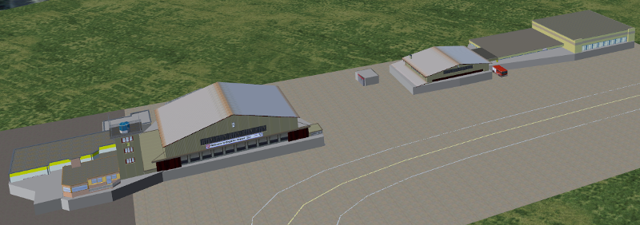
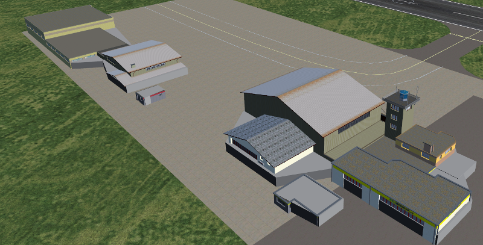
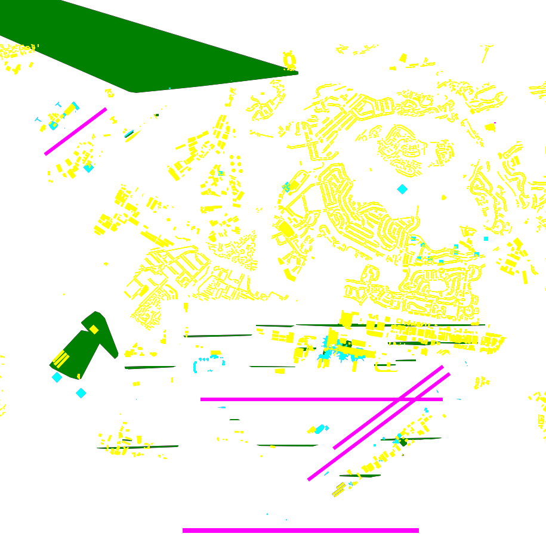
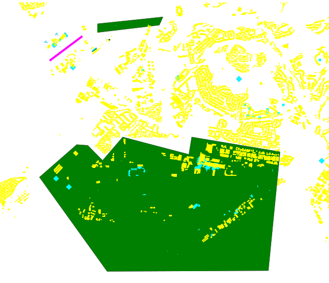
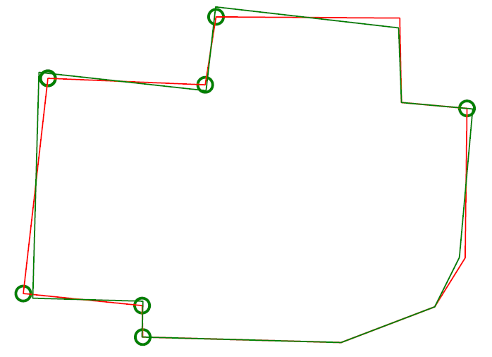
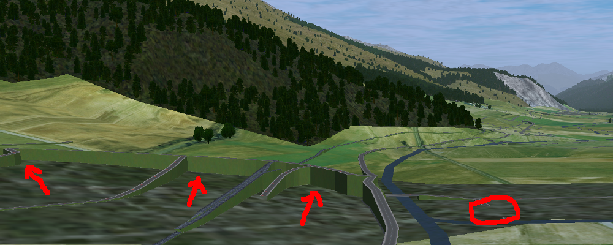
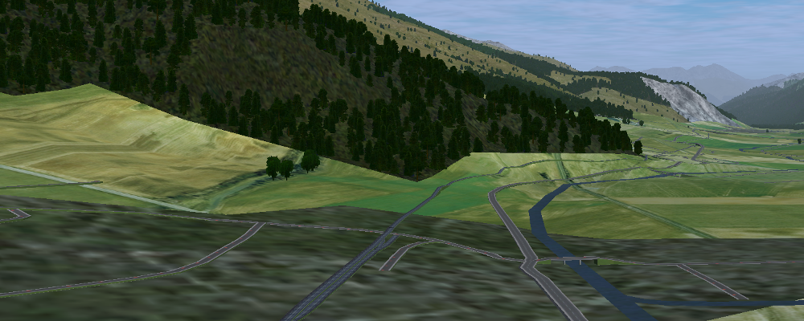
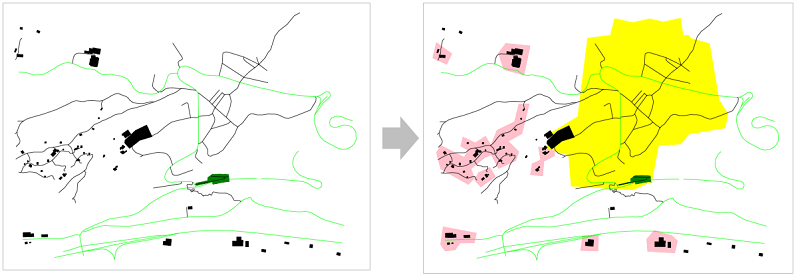

.. _chapter-parameters-label:

####################
Parameters [Builder]
####################

Please consider the following:

* Python does not recognize operating system environment variables, please use full paths in the parameters file (no ``$HOME`` etc).
* These parameters determine how scenery objects are generated offline as described in chapter :ref:`Scenery Generation <chapter-generation-label>`.
* All decimals need to be with "." — i.e. local specific decimal separators like "," are not accepted.
* Unless specified otherwise then all length is in metres and areas are in square metres.
* You do not have to specify all parameters in your ``params.py`` file. Actually it is better only to specify those parameters, which you want to actively control — the rest just gets the defaults.

=========================
View a List of Parameters
=========================

The final truth about parameters is stored in ``parameters.py`` — unfortunately the content in this chapter of the manual might be out of date (including default values).

It might be easiest to read ``parameters.py`` directly. Python code is easy to read also for non-programmers. Otherwise you can run the following to see a listing:

::

    /usr/bin/python3 /home/vanosten/develop_vcs/osm2city/parameters.py -d

If you want to see a listing of the actual parameters used during scenery generation (i.e. a combination of the defaults with the overridden values in your ``params.py`` file, then you can run the following command:

::

    /usr/bin/python3 --file /home/pingu/development/osm2city/parameters.py -f LSZS/params.py

====================
Important Parameters
====================

.. _chapter-param-minimal-label:

-----------
Minimal Set
-----------

See also :ref:`Setting a Minimal Set of Parameters <chapter-setting-parameters-label>`.

=============================================   ========   =======   ==============================================================================
Parameter                                       Type       Default   Description / Example
=============================================   ========   =======   ==============================================================================
PREFIX                                          String     n/a       Name of the scenery project. Do not use spaces in the name.

PATH_TO_SCENERY                                 Path       n/a       Full path to the scenery folder without trailing slash. This is where we will
                                                                     probe elevation and check for overlap with static objects. Most likely you'll
                                                                     want to use your TerraSync path here.

PATH_TO_AIRPORTS                                Path       None      Full path to WS3 airports folder - will be added for elevation probing if
                                                                     not None.

PATH_TO_SCENERY_OPT                             List       None      Optional additional paths to scenery folders (e.g. for `Project3000`_).
                                                                     Specified as a list of strings (e.g. ['/foo/uno', '/foo/due'].
                                                                     Only used for overlap checking for buildings against static and shared
                                                                     objects.

PATH_TO_OUTPUT                                  Path       n/a       The generated scenery (.stg, .ac, .xml) will be written to this path. If empty
                                                                     then the correct location in PATH_TO_SCENERY is used. Note that if you use
                                                                     TerraSync for PATH_TO_SCENERY, you MUST choose a different path here. 
                                                                     Otherwise, TerraSync will overwrite the generated scenery. Unless you know 
                                                                     what you are doing, there is no reason not to specify a dedicated path here.
                                                                     While not absolutely needed it is good practice to name the output folder 
                                                                     the same as ``PREFIX``.

PROBE_FOR_WATER                                 Boolean    False     Checks the scenery in ``PATH_TO_SCENERY`` whether points are in the water or
                                                                     not. The FlightGear scenery's water boundaries might be different from OSM.
                                                                     E.g. removes buildings if at least one corner is in the water. And removes
                                                                     or splits (parts of) roads/railways, if at least 1 point is in the water.
                                                                     Only possible with FGElev version after 9th of November 2016 / FG 2016.4.1.

=============================================   ========   =======   ==============================================================================

.. _`Project3000`: http://wiki.flightgear.org/Project3000

.. _chapter-param-flags-label:

---------------
Important Flags
---------------

=============================================   ========   =======   ==============================================================================
Parameter                                       Type       Default   Description / Example
=============================================   ========   =======   ==============================================================================
FLAG_STG_BUILDING_LIST                          Boolean    False     If True then some buildings use the Random Building code in FlightGear instead
                                                                     of a building mesh, which reduces scenery size and can help with rendering
                                                                     performance.

BUILDING_USE_SHARED_WORSHIP                     Boolean    False     Use a shared model for worship buildings instead of OSM floor plan and
                                                                     heuristics. The shared models will try to respect the type of building (e.g.
                                                                     church vs. mosque) and will in size (not height) respect the convex hull of
                                                                     the building floor plan in OSM.
                                                                     If the building is composed of several parts as in OSM 3D buildings, then no
                                                                     shared models are used - as it is assumed that the 3D modeling is more
                                                                     realistic (e.g number and height of towers) than a generic model, although
                                                                     the facade texture is more dumb than a typical shared model texture.

NO_ELEV                                         Boolean    False     The only reason to set this to ``True`` would be for scenery builders to
                                                                     check generated scenery objects a bit faster not caring about the vertical
                                                                     position in the scenery.

=============================================   ========   =======   ==============================================================================

=========
Buildings
=========

.. _chapter-parameters-buildings-diverse:

------------------
Diverse Parameters
------------------

Parameters which influence the number of buildings from OSM taken to output.

=============================================   ========   =======   ==============================================================================
Parameter                                       Type       Default   Description / Example
=============================================   ========   =======   ==============================================================================
BUILDING_MIN_HEIGHT                             Number     0.0       Minimum height from bottom to top without roof height of a building to be
                                                                     included in output (does not include roof). Different from OSM tag
                                                                     "min_height", which states that the bottom of the building hovers min_height
                                                                     over the ground. If set to 0.0, then not taken into consideration (default).
BUILDING_MIN_AREA                               Number     50.0      Minimum area for a building to be included in output (not used for buildings
                                                                     with parent).
BUILDING_PART_MIN_AREA                          Number     10.0      Minimum area for building:parts.
BUILDING_REDUCE_THRESHOLD                       Number     200.0     Threshold area of a building below which a rate of buildings gets reduced
                                                                     from output.
BUILDING_REDUCE_RATE                            Number     0.5       Rate (between 0 and 1) of buildings below a threshold which get reduced
                                                                     randomly in output.
BUILDING_REDUCE_CHECK_TOUCH                     Boolean    False     Before removing a building due to area, check whether it is touching another
                                                                     building and therefore should be kept.
BUILDING_NEVER_REDUCE_LEVELS                    Integer    6         Buildings that tall will never be removed in removing.

BUILDING_TEXTURE_GROUP_RADIUS_M                 Integer    0         For BUILDING_LIST buildings, distance within which buildings will tend to
                                                                     have the same texture (e.g. in the UK, Netherlands).
                                                                     Heuristics are only used if value > 0. A typical value would be around 2000.

=============================================   ========   =======   ==============================================================================

In order to reduce the total number of nodes of the buildings mesh and thereby reducing both disk space volume and rendering demands as well as to simplify the rendering of roofs, the geometry of buildings is simplified as follows:

* Only if not part of a building parent
* Only if no inner circles
* Only if a multiple of 4 nodes gets reduced and always 4 neighbouring points are removed at the same time (e.g. something that looks like a balcony from above, but can also point inwards into the building)
* If points get removed, which are also part of a neighbour building, then the simplification is not accepted.
* The tolerance of the below parameters is respected.

=============================================   ========   =======   ==============================================================================
Parameter                                       Type       Default   Description / Example
=============================================   ========   =======   ==============================================================================
BUILDING_SIMPLIFY_TOLERANCE_LINE                Number     1.0       The point on the base line may at most be this value away from the straight
                                                                     line between the node before the balcony and the node after the balcony.
                                                                     This in order to prevent that e.g. a stair-case feature is removed.
BUILDING_SIMPLIFY_TOLERANCE_AWAY                Number     2.5       The 2 points sticking out (or in) may not be more than this value away from
                                                                     the straight line between the node before the balcony and the node after the
                                                                     balcony. This in order to prevent clearly visible "balconies" to be removed.
=============================================   ========   =======   ==============================================================================

.. _chapter-parameters-buildings-level-height:

--------------------------
Building Levels and Height
--------------------------

In OSM the height of a building can be described using the following keys:

* ``building:height``
* ``roof:height``
* ``height`` (the total of building_height and roof_height, but most often used alone)
* ``building:levels``
* ``roof:levels`` (not used in osm2city)
* ``levels``

Most often none of these features are tagged and then the number of levels are determined based on the settlement type and the corresponding ``BUILDING_NUMBER_LEVELS_*`` parameter. The height is always calculated as the product of the number of levels times parameter ``BUILDING_LEVEL_HEIGHT_*``. If only the height is given, then the levels are calculated by simple rounding — and this level value is then used for calculating the height. The reason for this is that some uniformity in building heights/values is normally observed in the real world — and because the generic textures used have a defined height per level.

An exception to this is made for building parts in a relationship (`Simple 3D buildings`_), as the heights in this case might be necessary to be correct (e.g. a dome on a church).

There is some randomness about the number of levels within the same settlement type, which is determined by using a dictionary of level=ratio pairs, like:

::

    BUILDING_NUMBER_LEVELS_CENTRE = {4: 0.2, 5: 0.7, 6: 0.1}

meaning that there is a ratio 0f 0.2 for 4 levels, a ratio of 0.7 for 5 levels and a ratio of 0.1 for 6 levels. I.e. the keys are integers for the number of levels and the values are the ratio, where the sum of ratios must be 1.

=============================================   ========   =======   ==============================================================================
Parameter                                       Type       Default   Description / Example
=============================================   ========   =======   ==============================================================================
BUILDING_NUMBER_LEVELS_*                        Dict       .         A dictionary of level/ratio pairs per settlement type, which is used when a
                                                                     building does not contain information about the number of levels.
                                                                     If the building class is not ``residential`` or ``residential_small`` and the
                                                                     settlement type is not ``centre`` or ``block``, then specific parameters
                                                                     are used for apartments, industrial/warehouse and others.

=============================================   ========   =======   ==============================================================================

.. _Simple 3D buildings: http://wiki.openstreetmap.org/wiki/Simple_3D_buildings

.. _chapter-parameters-buildings-underground:

--------------------------------
Visibility Underground Buildings
--------------------------------

There seem to be challenges with consistency etc. in OSM in terms of deciding, whether something is under the ground and therefore ``osm2city`` should not render it.

According to findings in the `FG Forum <https://forum.flightgear.org/viewtopic.php?f=5&t=22809&start=1080#p347959>`_ and OSM there are different tags used, some of them better suited than others according to OSM documentation:

* ``location=underground`` or ``location=indoor`` seems to be a correct way (`key:location <https://wiki.openstreetmap.org/wiki/Key:location>`_)
* ``indoor`` has also some usage (`key:indoor <https://wiki.openstreetmap.org/wiki/Key:indoor>`_)
* ``tunnel`` is according to taginfo (`taginfo tunnel combinations <https://taginfo.openstreetmap.org/keys/?key=tunnel#combinations>`_) used max 1000 times together with buildings
* ``level`` with negative values. NB: not to be confused with ``levels`` and ``building:levels`` (see chapter :ref:`Building Levels and Height <chapter-parameters-buildings-level-height>`)
* ``layer`` is not to be used to determine visibility (`key:layer <https://wiki.openstreetmap.org/wiki/Key:layer>`_)

=============================================   ========   =======   ==============================================================================
Parameter                                       Type       Default   Description / Example
=============================================   ========   =======   ==============================================================================
BUILDING_UNDERGROUND_LOCATION                   Boolean    True      Do not show buildings or building:parts if key ``location`` has value
                                                                     ``underground`` or ``indoor``.

BUILDING_UNDERGROUND_INDOOR                     Boolean    True      Do not show buildings or building:parts if key ``indoor`` is present and its
                                                                     value is not ``no``.

BUILDING_UNDERGROUND_TUNNEL                     Boolean    True      Do not show buildings or building:parts if key ``tunnel`` is present and its
                                                                     value is not ``no``.

BUILDING_UNDERGROUND_LEVEL_NEGATIVE             Boolean    True      Do not show buildings or building:parts if key ``level`` has a negative value
                                                                     and neither key ``levels`` or ``building:levels`` have a non-negative value.

=============================================   ========   =======   ==============================================================================

.. _chapter-parameters-roofs-label:

------------------
Roofs on Buildings
------------------

Below you will find quite a lot of parameters deciding what type of roofs should be generated on buildings. To understand the basic concepts, you should understand `OSM Simple 3D buildings`_. With ``complex roof`` below all those roof types, which are not flat/horizontal are meant.

The following parameters decide whether a complex roof should be used on top of a building at all.

=============================================   ========   =======   ==============================================================================
Parameter                                       Type       Default   Description / Example
=============================================   ========   =======   ==============================================================================
BUILDING_COMPLEX_ROOFS                          Bool       True      Set this to false if only flat roofs should be used. Good for performance, but
                                                                     not so nice for the eye.
                                                                     If this is set to False, all other parameters do not matter.

BUILDING_COMPLEX_ROOFS_MIN_LEVELS               Integer    1         Don't put complex roof on buildings smaller than the specified value unless
                                                                     there is an explicit ``roof:shape`` flag in OSM.

BUILDING_COMPLEX_ROOFS_MAX_LEVELS               Integer    5         Don't put complex roofs on buildings taller than the specified value unless
                                                                     there is an explicit ``roof:shape`` flag in OSM.

BUILDING_COMPLEX_ROOFS_MAX_AREA                 Integer    1600      Don't put complex roofs on buildings larger than this.

BUILDING_COMPLEX_ROOFS_MIN_RATIO_AREA           Integer    600       If a building is larger than this but smaller than ``..._MAX_AREA``, then
                                                                     it is compared whether the building tends to be small and long, because often
                                                                     on more square buildings, which at the same time are large, the roof tends
                                                                     to be flat.

BUILDING_SKEL_MAX_NODES                         Integer    10        The maximum number of nodes for which a complex roof is generated. The higher
                                                                     the number, the longer the execution time but the more houses actually get
                                                                     realistic roofs.

BUILDING_ROOF_SHAPE_RATIO                       Dict       n/a       If the ``roof:shape`` tag is missing in OSM (which it most often is), then
                                                                     this parameter can help to make region specific decisions on what roof types
                                                                     are to be applied randomly with a given ratio.
                                                                     The sum of the ratios must give 1.0 and the values must be one of the values
                                                                     defined for RoofShapes in roof.py.

BUILDING_ROOF_COLOUR_MATERIAL_PITCHED_RATIO     Dict       n/a       If the ``roof_material`` and/or the ``roof_colour`` are missing for a pitched
                                                                     roof, then a distribution can be set. The distribution must sum up to 1.0.
                                                                     Flat roofs are more "universal" and might not need a regionalization.
                                                                     The first value in the tuple is the colour, the second the material.
                                                                     E.g. ``(s.V_BLACK, s.V_ROOF_TILES): 0.3, (s.V_GREY, s.V_METAL): 0.05, ...``

BUILDING_ROOF_SIMPLIFY_TOLERANCE                Number     0.5       All points in the simplified roof will be within the tolerance distance of
                                                                     the original geometry.

=============================================   ========   =======   ==============================================================================

Finally the following parameters let you play around with how complex roofs are done.

=============================================   ========   =======   ==============================================================================
Parameter                                       Type       Default   Description / Example
=============================================   ========   =======   ==============================================================================
BUILDING_SKEL_ROOFS_MIN_ANGLE                   Integer    10        The minimum angle of the roof
BUILDING_SKEL_ROOFS_MAX_ANGLE                   Integer    50        The max angle of the roof. Some randomness is applied between MIN and MAX.
BUILDING_SKILLION_ROOF_MAX_HEIGHT               Decimal    2.        No matter the MIN and MAX angles: a skillion will have at most this height
                                                                     difference.
BUILDING_SKEL_ROOF_MAX_HEIGHT                   Decimal    6.        Skip skeleton roofs (gabled, pyramidal, ..) if the roof height is larger than
                                                                     this value.
=============================================   ========   =======   ==============================================================================

.. _`OSM Simple 3D buildings`: http://wiki.openstreetmap.org/wiki/Simple_3D_buildings

.. _chapter-parameters-overlap-label:

-------------------------------------
Overlap Check for Buildings and Roads
-------------------------------------

Overlap checks try to omit overlap of features generated based on OSM data with static objects as well as shared objects (depending on parameter ``OVERLAP_CHECK_CONSIDER_SHARED``) in the default scenery (defined by ``PATH_TO_SCENERY``).

If parameter ``PATH_TO_SCENERY_OPT`` is not None, then also object from that path are considered (e.g. for Project3000).

=============================================   ========   =======   ==============================================================================
Parameter                                       Type       Default   Description / Example
=============================================   ========   =======   ==============================================================================
OVERLAP_CHECK_CH_BUFFER_STATIC                  Decimal    0.0       Buffer around static objects to extend the overlap area. In general convex
                                                                     hull is already a conservative approach, so using 0 (zero) should be fine.

OVERLAP_CHECK_CH_BUFFER_SHARED                  Decimal    0.0       Same as above but for shared objects.

OVERLAP_CHECK_CONSIDER_SHARED                   Bool       True      Whether only static objects (i.e. a unique representation of a real world
                                                                     thing) should be taken into account — or also shared objects (i.e. generic
                                                                     models reused in different places like a church model).
                                                                     For this to work ``PATH_TO_SCENERY`` must point to the TerraSync directory.

OVERLAP_CHECK_APT_DAT_SCENERY_LIST              List       None      Search for apt.dat files within this list of scenery directories.
                                                                     Files of the form ``NavData/apt/*.dat[.gz]`` in these directories will be
                                                                     used for the purpose of overlap checks.
                                                                     If None (default), ``PATH_TO_SCENERY`` and ``PATH_TO_SCENERY_OPT`` are used.
                                                                     The information in ``${FG_ROOT}/Airport/apt.dat.gz`` is always read first.
                                                                     If information for the same airport is found in several files, only the last
                                                                     is used.
                                                                     If this parameter is set to ``[]``, then it prevents the info in
                                                                     ``PATH_TO_SCENERY*`` to be read for additional apt.dat files.

OVERLAP_CHECK_APT_PAVEMENT_BUILDINGS_INCLUDE    List       []        At airports in list include overlap check with pavement for buildings.
                                                                     Pavements are e.g. APRON and taxiways (but not runways and helipads).
                                                                     If the list is empty, then checks at all airports are done.
                                                                     If the value is ``None``, then overlap check is done only against runways
                                                                     and helipads, but not for pavements - which should be fine for buildings.

OVERLAP_CHECK_APT_PAVEMENT_ROADS_INCLUDE        List       []        Ditto for roads and railways - but default value is ``[]`` i.e. checks
                                                                     against pavements are done at all airports.
                                                                     Example of list: ``['ENAT', 'LSZR']``

OVERLAP_CHECK_APT_BOUNDARY_ROADS                Bool       True      Use also the airport boundary for overlap checks with roads/railways. Not all
                                                                     airports have a boundary, so therefore the other checks will still apply.
                                                                     Most often the boundary includes all runways etc., but not always.
                                                                     This makes sure that roads/railways do not influence FG planes on airports,
                                                                     but it also removes some visual fidelity. Especially in WS30 when
                                                                     airport data can be updated more often, then often the airport data
                                                                     already has these features and might therefore be rendered better than
                                                                     using OSM data.

OVERLAP_CHECK_APT_BOUNDARY_BUILDINGS            Bool       True      Ditto for buildings.

OVERLAP_CHECK_APT_USE_OSM_APRON_ROADS           Bool       True      Add OSM data for APRONs to overlap check. Rarely necessary - but safe.

OVERLAP_CHECK_ROAD_MIN_REMAINING                Integer    10        When a static bridge model or other blocked area (e.g. airport object)
                                                                     intersect with a way, how much must at least be left so the way is kept after
                                                                     intersection.

OVERLAP_CHECK_EXCLUDE_AREAS_BUILDINGS           List       None      Areas blocked for placing buildings. It is a list of polygons defining the
                                                                     areas to exclude. Each polygon is a list of lon/lat coordinates, where the
                                                                     last element automatically connects to the first element to close the polygon.
                                                                     The coordinate points must be defined counter-clock wise.
                                                                     This is a last resort to handle situations, where the built in mechanism
                                                                     cannot handle especially static elements, because their geometry is not
                                                                     clearly handled when interpreting the corresponding ac-file.
                                                                     See example below the table for PHNL.

OVERLAP_CHECK_EXCLUDE_AREAS_ROADS               List       None      Ditto for roads. Often they will be the same - but not always.
=============================================   ========   =======   ==============================================================================

Examples of overlap objects based on static objects at LSZS (light grey structures at bottom of buildings):

An example of difficult to handle situations is PHNL (Hawaii), where several objects inside the ac-file have rotations. The picture below shows the blocked areas (green) automatically detected. E.g. the large green area top left is a static object for the Admiral Bernard Chick Clarey Bridge. At the PHNL airport the green stripes parallel to the runway should actually be rather large areas covering most of the hangar areas of the airport.

The next image shows the blocked areas by parameter as well as the code to define these areas. There are at least two problems with this: (a) such issues cannot be detected automatically and (b) it is tedious and error prone to define these polygons. This is more a proof of concept and a "hack" for PHNL than anything else.

Remark in the parameters below that for roads only the bridge has been excluded - that is because it has been tested visually (again: tedious and slow).

::

    _admiral_clarey_bridge = [(-157.953, 21.3693), (-157.953, 21.3671), (-157.9356, 21.3690), (-157.9346, 21.3711)]
    _phnl_airport = [(-157.9015, 21.3354), (-157.9264, 21.3393), (-157.9272, 21.3347), (-157.9459, 21.3393),
                    (-157.9516, 21.3331), (-157.9558, 21.3371), (-157.9589, 21.3373), (-157.9694, 21.3287),
                    (-157.9503, 21.3038), (-157.9048, 21.3040)]
    OVERLAP_CHECK_EXCLUDE_AREAS_ROADS = [_admiral_clarey_bridge]
    OVERLAP_CHECK_EXCLUDE_AREAS_BUILDINGS = [_admiral_clarey_bridge, _phnl_airport]

-----------------
Rectify Buildings
-----------------
Rectifies angles of corners in buildings to 90 degrees as far as possible (configurable). This operation works on existing buildings as mapped in OSM. It corrects human errors during mapping, when angles are not straight 90 degrees (which they are in reality for the major part of corners). I.e. there is no new information added, only existing information corrected.

This operation is mainly used for eye-candy and to allow easier 3-D visualization. It can be left out if you feel that the OSM mappers have done a good job / used good tooling. On the other hand the processing time compared to other operations is negligible.

The following picture shows an example of a rectified building with a more complex layout. The results are more difficult to predict the more corners there are. The red line is the original boundary, the green line the rectified boundary. Green circles are at corners, where the corner's angle is different from 90 degrees but within a configurable deviation (typically between 5 and 10 degrees). Corners shared with other buildings are not changed by the rectify algorithm (not shown here).

Please note that if you are annoyed with angles in OSM, then you have to rectify them manually in OSM.

=============================================   ========   =======   ==============================================================================
Parameter                                       Type       Default   Description / Example
=============================================   ========   =======   ==============================================================================
RECTIFY_ENABLED                                 Boolean    True      Toggle whether the rectify operation should be used.

RECTIFY_90_TOLERANCE                            Number     0.1       Small tolerance from 90 degrees not leading to rectification of corner.

RECTIFY_MAX_90_DEVIATION                        Number     7         By how much an angle can be smaller or larger than 90 to still be rectified.
                                                                     You might need to experiment a bit and use plotting to determine a good value.

RECTIFY_MAX_DRAW_SAMPLE                         Number     20        How many randomly chosen buildings having rectified corners shall be plotted.
                                                                     The more buildings the better for comparison. However plotting can take quite
                                                                     some time and system resources.

RECTIFY_SEED_SAMPLE                             Boolean    True      If set to True then the randomizer uses a different seed each time.
                                                                     In some situations it might be better when the same set of random buildings
                                                                     are plotted each time - e.g. when experimenting with parameters and wanting to
                                                                     compare the outcomes.

=============================================   ========   =======   ==============================================================================

.. _chapter-parameters-light:

--------------------------
Light Effects on Buildings
--------------------------

Parameters for some light effects.

=============================================   ========   =======   ==============================================================================
Parameter                                       Type       Default   Description / Example
=============================================   ========   =======   ==============================================================================
OBSTRUCTION_LIGHT_MIN_HEIGHT                    Integer    150       Puts red obstruction lights on buildings >= the specified number levels.
                                                                     If you do not want this, then just set the value to 0. The official FAA
                                                                     `source`_ specifies 499 feet (153 m) as a rule.

BUILDING_FAKE_AMBIENT_OCCLUSION                 Boolean    True      Fake ambient occlusion by darkening facade textures towards the ground, using
                                                                     the formula 1 - VALUE * exp(- AGL / HEIGHT ) during texture atlas generation.
BUILDING_FAKE_AMBIENT_OCCLUSION_HEIGHT          Number     6.        (see above)
BUILDING_FAKE_AMBIENT_OCCLUSION_VALUE           Number     0.6       (see above)

=============================================   ========   =======   ==============================================================================

.. _`source`: https://www.faa.gov/documentlibrary/media/advisory_circular/ac_70_7460-1l_.pdf

.. _chapter-parameters-building-generation:

---------------------------------------------------
Generating Buildings Where OSM is Missing Buildings
---------------------------------------------------

It is possible to let ``osm2city`` generate buildings, where it is plausible that there in reality would be buildings, but buildings were not mapped in OSM. The following set of parameters make some customisation to specific areas possible. However parts of the processing is rather hard-coded. Still the results are much better than an empty scene. One drawback for users using orthophotos si that the generated buildings probably will not align with the texture (this is mostly not a concern for OSM mapped buildings).

No additional buildings are generated inside zones for aerodromes.

A lot of processing is dependent on land-use information (see e.g. :ref:`Land-use Handling <chapter-howto-land-use-label>` and :ref:`Land-use Parameters <chapter-parameters-landuse-label>`). For a short explanation of the process used see :ref:`Generate Would-Be Buildings <chapter-howto-generate-would-be-buildings-label>`.

In settlement areas an attempt is made to have the same terrace houses or apartment buildings along both sides of a way.

The first set of parameters determines the overall placement heuristics:

=============================================   ========   =======   ==============================================================================
Parameter                                       Type       Default   Description / Example
=============================================   ========   =======   ==============================================================================
OWBB_GENERATE_BUILDINGS                         Boolean    False     Set this to True to generate buildings.
OWBB_USE_GENERATED_LANDUSE_FOR_B.._GENERATION   Boolean    False     Generated land use is based on existing OSM buildings but missing land-use
                                                                     information. Therefore there is a fair chance that no additional buildings are
                                                                     plausible.
OWBB_USE_EXTERNAL_LANDUSE_FOR_B.._GENERATION    Boolean    True      External land-use is only added, where OSM is missing and no generated
                                                                     land-use is available. Currently this only land-use from FlightGear (parameter
                                                                     ``OWBB_USE_BTG_LANDUSE``), which is why most probably plausible buildings
                                                                     should be generated.
OWBB_STEP_DISTANCE                              Integer    2         How many meters along the way to travel before trying to set a building again.
                                                                     Smaller values might be more accurate, but also increase processing time.
OWBB_MIN_STREET_LENGTH                          Integer    10        How long a way needs to be at least to be considered for generating buildings
                                                                     along.
OWBB_MIN_CITY_BLOCK_AREA                        Integer    200       The minimal area of a city block along a way to be considered for generating
                                                                     buildings.
OWBB_RESIDENTIAL_HIGHWAY_MIN_GEN_SHARE          Decimal    0.3       If there are already buildings along the way: what is the minimal share of
                                                                     an uninterrupted length along the way to consider for terraces or apartments
                                                                     (detached houses might still be "built").
OWBB_ZONE_AREA_MAX_GEN                          Decimal    0.1       If the share of floor area of exiting OSM buildings compared to the whole
                                                                     area is above this value, then no extra buildings are placed.
                                                                     In the future this value might need to be specific per settlement type.
OWBB_HIGHWAY_WIDTH_FACTOR                       Decimal    1.3       Factor applied to highway width in order to push buildings exponential more
                                                                     away from high level highways (highway.width ** factor)

=============================================   ========   =======   ==============================================================================

The second set of parameters determines the type of residential buildings to use and the distances between the buildings and the street as well as what happens in the backyard. The ``width`` of a building is along the street, the ``depth`` of a building is away from the street (front door to back door).

=============================================   ========   =======   ==============================================================================
Parameter                                       Type       Default   Description / Example
=============================================   ========   =======   ==============================================================================
OWBB_RESIDENTIAL_RURAL_TERRACE_SHARE            Decimal    0.1       The share of terraces / row houses in rural settlement areas. Most houses are
                                                                     detached, which is the default.
OWBB_RESIDENTIAL_PERIPHERY_TERRACE_SHARE        Decimal    0.25      Ditto in periphery settlement areas.
OWBB_RESIDENTIAL_RURAL_APARTMENT_SHARE          Decimal    0.1       The share of apartment buildings in rural settlement areas.
OWBB_RESIDENTIAL_PERIPHERY_APARTMENT_SHARE      Decimal    0.3       Ditto in periphery settlement areas.
OWBB_RESIDENTIAL_DENSE_TYPE_SHARE               Dict                 In dense areas not everything is attached like in block or centre settlement
                                                                     areas. It can be quite region specific. Therefore there is quite a choice for
                                                                     specifying the distribution. E.g.
                                                                     ``{'detached': 0.1, 'terraces': 0.1, 'apartments': 0.3, 'attached': 0.5}``.
OWBB_RESIDENTIAL_TERRACE_MIN_NUMBER             Integer    4         The minimum number of terrace houses to fit along a street before it is
                                                                     considered to build terraces along the way.
OWBB_RESIDENTIAL_TERRACE_TYPICAL_NUMBER         Integer    5         The typical number of terrace houses attached to each other before there will
                                                                     be a break. The actual number is randomized around this value.
OWBB_RESIDENTIAL_SIDE_FACTOR_PERIPHERY          Decimal    1.0       The default buffer on the side of detached houses and apartment houses is
                                                                     the sqaure root of the house's width. So the distance between two houses gets
                                                                     the square root of the one house's width plus the square root of the other
                                                                     house's width. This factor is multiplied to allow some linear correction for
                                                                     region specific adaptation. E.g. in Switzerland the houses tend to be farther
                                                                     apart along the street than in Denmark (the opposite is true for the
                                                                     backyard). This factor is used for rural and periphery settlement types.
OWBB_RESIDENTIAL_SIDE_FACTOR_DENSE              Decimal    0.8       Ditto for dense settlement type. Attached houses and terrace houses have a
                                                                     distance of ca. 0 (it is not exactly 0 due to the way placements are made
                                                                     in the heuristics - but close enough; you can play with the step distance).
OWBB_RESIDENTIAL_BACK_FACTOR_PERIPHERY          Decimal    2.0       Same as the ..SIDE_FACTOR.., but now for the back. Again the starting point
                                                                     is a square root - this time of the building's depth.
OWBB_RESIDENTIAL_FRONT_FACTOR_PERIPHERY         Decimal    1.0       Same as the ..SIDE_FACTOR.., but now for the back. The starting point is
                                                                     the square root of the building's width.
OWBB_FRONT_DENSE                                Decimal    3.0       The distance in metres between the street and the front. Same for settlement
                                                                     types ``dense``, ``block`` and ``centre``.

=============================================   ========   =======   ==============================================================================

Finally a set of parameters for industrial buildings:

=============================================   ========   =======   ==============================================================================
Parameter                                       Type       Default   Description / Example
=============================================   ========   =======   ==============================================================================
OWBB_INDUSTRIAL_LARGE_MIN_AREA                  Integer    500       The minimal number of square metres for an industrial building being
                                                                     considered large.
OWBB_INDUSTRIAL_LARGE_SHARE                     Decimal    0.4       If the building zone type is industrial, then this share is used between
                                                                     large buildings and smaller buildings.
OWBB_INDUSTRIAL_BUILDING_SIDE_MIN               Decimal    2.0       The minimal buffer around a building - so the total distance between two
                                                                     industrial buildings is at least twice this value. The actual value used is
                                                                     chosen randomly between the .._SIDE_MIN and .._SIDE_MAX.
OWBB_INDUSTRIAL_BUILDING_SIDE_MAX               Decimal    5.0       See above.

=============================================   ========   =======   ==============================================================================

.. _chapter-parameters-roads:

================================
Linear Objects (Roads, Railways)
================================

Parameters for roads, railways and related bridges. One of the challenges to show specific textures based on OSM data is to fit the texture such that it drapes ok on top of the scenery. Therefore several parameters relate to enabling proper draping.

=============================================   ========   =======   ==============================================================================
Parameter                                       Type       Default   Description / Example
=============================================   ========   =======   ==============================================================================
BRIDGE_MIN_LENGTH                               Decimal    20.       Discard short bridges and draw roads or railways instead.

MIN_ABOVE_GROUND_LEVEL                          Decimal    0.1       How much a highway / railway is at least hovering above ground

DISTANCE_BETWEEN_LAYERS                         Decimal    0.2       How much different layers of roads/railways at the same node are separated.

MIN_EMBANKMENT_HEIGHT                           Decimal    0.4       How much extra elevation compared to ground (v_add) there is, before an
                                                                     embankment is added at the side(s). This happens especially in bumpy areas and
                                                                     for roads along a steep hill side.

MAX_TRANSVERSE_GRADIENT                         Decimal    0.1       If the difference between the elevation at the right edge of a road and the
                                                                     elevation at the left edge of the road divided by the width of the road is
                                                                     larger than the gradient, then the road surface is levelled by adding v_add.
                                                                     Otherwise it is accepted that the road is a bit sloped from left to right.

HIGHWAY_TYPE_MIN                                Integer    4         The lower the number, the smaller ways in the highway hierarchy are added.
                                                                     Currently the numbers are as follows (see roads.py -> HighwayType).
                                                                     motorway = 12
                                                                     trunk = 11
                                                                     primary = 10
                                                                     secondary = 9
                                                                     tertiary = 8
                                                                     unclassified = 7
                                                                     road = 6
                                                                     residential = 5
                                                                     living_street = 4
                                                                     service = 3
                                                                     pedestrian = 2
                                                                     slow = 1 (cycle ways, tracks, footpaths etc).

POINTS_ON_LINE_DISTANCE_MAX                     Integer    1000      The maximum distance between two points on a line. If longer, then new points
                                                                     are added. This parameter might need to get set to a smaller value in order to
                                                                     have enough elevation probing along a road/highway. Together with parameter
                                                                     MIN_ABOVE_GROUND_LEVEL it makes sure that fewer residuals of ways are below 
                                                                     the scenery ground. The more uneven a scenery ground is, the smaller this 
                                                                     value should be chosen. The drawback of small values are that the number
                                                                     of faces gets bigger affecting frame rates.

MAX_SLOPE_ROAD                                  Decimal    0.15      The maximum allowed slope. It is used for ramps to bridges, but it is also
                                                                     used for other ramps. Especially in mountainous areas you might want to set
                                                                     higher values. This leads to steeper ramps to bridges, but give much fewer
                                                                     residuals with embankments.
MAX_SLOPE_MOTORWAY                              Decimal    0.07      (ditto) for motorways. It is seldom that motorways have lopes more than 0.04,
                                                                     but e.g. in Switzerland there are places with over 6% - e.g. `A12`_.
MAX_SLOPE_RAILWAY                               Decimal    0.08      (ditto) for railways. With `adhesion`_ only railways are along motorways in
                                                                     terms of max slopes.
MAX_SLOPE_TRAM                                  Decimal    0.14      (ditto) for trams, which also use `adhesion`_, but can be steeper.
MAX_SLOPE_RACK                                  Decimal    0.49      For railways with racks the steepest is Pilatus Railway with 48% incline.

USE_TRAM_LINE                                   Boolean    False     Often tram lines are on top of existing roads or between. This can lead to
                                                                     roads being (partially) hidden etc.

=============================================   ========   =======   ==============================================================================

.. _`A12`: https://en.wikipedia.org/wiki/A12_motorway_(Switzerland)

.. _`adhesion`: https://en.wikipedia.org/wiki/List_of_steepest_gradients_on_adhesion_railways

With residuals:

After adjusted MAX_SLOPE_* and POINTS_ON_LINE_DISTANCE_MAX parameters:

.. _chapter-parameters-landuse-label:

========
Land-Use
========

Land-use data is only used for built-up area in ``osm2city``. All other land-use is per the scenery in FlightGear. The main use of the land-use information processed is to determine building types, building height etc. for those buildings (often the majority), where this information is lacking and therefore must be obtained by means of heuristics. See :ref:`Land-use <chapter-howto-land-use-label>` for an overall description.

=============================================   ========   =======   ==============================================================================
Parameter                                       Type       Default   Description / Example
=============================================   ========   =======   ==============================================================================
OWBB_LANDUSE_CACHE                              Boolean    False     Instead of calculating land-use related stuff including buildings from scratch
                                                                     each time, use cached (but possibly stale) data for speed-up.

=============================================   ========   =======   ==============================================================================

-----------------------------------
Complement OSM Land-Use Information
-----------------------------------

These operations complement land-use information from OSM based on some simple heuristics, where there currently are no land-use zones for built-up areas in OSM: If there are clusters of buildings outside of registered OSM land-use zones, then zones are added based on clusters of buildings and buffers around them. The land-use type is based on information of building types, amenities etc. — if available.

=============================================   ========   =======   ==============================================================================
Parameter                                       Type       Default   Description / Example
=============================================   ========   =======   ==============================================================================
OWBB_USE_BTG_LANDUSE                            Boolean    False     Read FlightGear scenery (BTG-files from existing TerraSync scenery) for
                                                                     land-use data to complement (not replace) data from OSM.

OWBB_GENERATE..._BUILDING_BUFFER_DISTANCE       Number     30        The minimum buffering distance around a building.
OWBB_GENERATE..._BUILDING_BUFFER_DISTANCE_MAX   Number     50        The maximum buffering distance around a building. The actual value is a
                                                                     function of the previous parameter and the building's size (the larger the
                                                                     building the larger the buffering distance - up to this max value.
OWBB_GENERATE_LANDUSE_LANDUSE_HOLES_MIN_AREA    Number     20000     The minimum area for a hole within a generated land-use that is kept as a
                                                                     hole (square metres).
OWBB_GENERATE..._SIMPLIFICATION_TOLERANCE       Number     20        The tolerance in metres used for simplifying the geometry of the generated
                                                                     land-use boundaries. Tolerance means that all points in the simplified
                                                                     land-use will be within the tolerance distance of the original geometry.

OWBB_SPLIT_MADE_UP_LANDUSE_BY_MAJOR_LINES       Boolean    True      Splits generated land-use by major lines, as typically land-use changes occur
                                                                     across larger boundaries. "Major lines" here are motorways, most railways
                                                                     (not trams) and waterways classified in OSM as rivers and canals.

=============================================   ========   =======   ==============================================================================

On the left side of the picture below the original OSM-data is shown, where there only is one land-use zone (green), but areas with buildings outside of land-use zones as well as several streets without buildings (which from an arial picture actually have lots of buildings — they have just not been mapped in OSM.

On the right side of the picture the pink areas are generated based on building clusters and the yellow zone is from CORINE data.

.. _BTG-files: http://wiki.flightgear.org/BTG_file_format

------------------------------------
Generating Areas Where Roads are Lit
------------------------------------

Land-use information is used to determine which roads are lit during the night (in addition to those roads which in OSM are explicitly tagged as
being lit).

The resulting built-up areas are also used for finding city and town areas — another reason why the values should be chosen conservative, i.e. large.

=============================================   ========   =======   ==============================================================================
Parameter                                       Type       Default   Description / Example
=============================================   ========   =======   ==============================================================================
OWBB_BUILT_UP_BUFFER                            Number     50        The buffer distance around built-up land-use areas to be used for lighting of
                                                                     streets. The number is chosen pretty large such that as many building zone
                                                                     clusters as possible are connected. Also it is not unusual that the lighting
                                                                     of streets starts a bit outside of a built-up area.
OWBB_BUILT_UP_AREA_HOLES_MIN_AREA               Number     100000    The minimum area in square metres a hole in a LIT_BUFFER needs to have to be
                                                                     not lit. In general this can be quite a large value and larger than e.g.
                                                                     parameter OWBB_GENERATE_LANDUSE_LANDUSE_HOLES_MIN_AREA.
OWBB_BUILT_UP_MIN_LIT_AREA                      Number     100000    The minimum area of a lit area, such that it is actually used for lighting of
                                                                     streets. Given buffering with ``OWBB_BUILT_UP_BUFFER`` alone is already a
                                                                     large area, this value must not be chosen too small.
=============================================   ========   =======   ==============================================================================

----------------------------------------
Size of Concentric Settlement Type Rings
----------------------------------------

The formula for the radius of the outer border of the ring is:

::

    radius = population^OWBB_PLACE_RADIUS_EXPONENT * OWBB_PLACE_RADIUS_FACTOR

=============================================   ========   =======   ==============================================================================
Parameter                                       Type       Default   Description / Example
=============================================   ========   =======   ==============================================================================
OWBB_PLACE_POPULATION_DEFAULT_CITY              Integer    200000    The default population for a settlement tagged with ``place=city``, where the
                                                                     population size is not tagged.
OWBB_PLACE_POPULATION_DEFAULT_TOWN              Integer    20000     Ditto for ``place=town``.
OWBB_PLACE_POPULATION_MIN_BLOCK                 Integer    15000     The minimum amount of people living in a ``place=town`` for it to have a
                                                                     settlement type ``block`` (i.e. where all builings are attached).
                                                                     If the population is based on default, then no ``block`` will be assigned.
OWBB_PLACE_RADIUS_EXPONENT_CENTRE               Number     0.5       The exponent for calculating the radius for settlement type ``centre``, i.e.
                                                                     1/2.
OWBB_PLACE_RADIUS_EXPONENT_BLOCK                Number     0.6       Ditto for type ``block``, i.e. 5/8.
OWBB_PLACE_RADIUS_EXPONENT_DENSE                Number     0.666     Ditto for type ``dense``, i.e. 2/3.
OWBB_PLACE_RADIUS_FACTOR_CITY                   Number     1.        Linear correction factor for radius when dealing with ``place=city``.
OWBB_PLACE_RADIUS_FACTOR_TOWN                   Number     1.        Ditto for ``place=town``.
OWBB_PLACE_TILE_BORDER_EXTENSION                Integer    10000     Extension of the perimeter (tile borders) to read place information from, as
                                                                     e.g. a city might extend across til border areas.
OWBB_PLACE_CHECK_DENSITY                        Boolean    False     Should only be used if majority of all buildings are mapped in OSM.
                                                                     Otherwise settlement type will be downgraded e.g. in areas based on BTG etc.
                                                                     Mostly for testing purposes and prrof of concept.
OWBB_PLACE_SANITY_DENSITY                       Number     0.15      Make sure that settlement type dense is assigned, if the density of a building
                                                                     zone is larger than a given ratio and the settlement type is rural or
                                                                     periphery. The density is calculated as the total of
                                                                     all buildings' floor area (inner rings' areas do also count) divided by the
                                                                     area of the building zone.
                                                                     Likewise if the density is lower than the ratio, but the settlement type is
                                                                     dense or block (not centre), then the type is changed to periphery.
=============================================   ========   =======   ==============================================================================

================
Other Parameters
================

.. _chapter-parameters-pylons_details:

-----------------
Detailed Features
-----------------

The following parameters determine, whether specific features for procedures ``pylons`` respectively ``details`` will be generated at all.

=============================================   ========   =======   ==============================================================================
Parameter                                       Type       Default   Description / Example
=============================================   ========   =======   ==============================================================================
C2P_PROCESS_POWERLINES                          Boolean    True      ``pylons``: Generate electrical power lines (incl. cables)
C2P_PROCESS_WIND_TURBINES                       Boolean    True      ``pylons``: wind turbines
C2P_PROCESS_STORAGE_TANKS                       Boolean    True      ``pylons``: Storage tanks either mapped as nodes or ways in OSM. Also includes
                                                                     silos.
C2P_PROCESS_CHIMNEYS                            Boolean    True      ``pylons``: Chimneys either mapped as nodes or ways in OSM
C2P_PROCESS_TREES                               Boolean    True      ``pylons``: Trees as per OSM tagging or interpreted in parks, cemeteries etc.
                                                                     This works only in FlightGear Next.
C2P_PROCESS_POWERLINES_MINOR                    Boolean    True      ``details``: Only considered if C2P_PROCESS_POWERLINES is True
C2P_PROCESS_AERIALWAYS                          Boolean    True      ``details``: Aerial ways is currently experimental and depends on local shared
                                                                     objects.
C2P_PROCESS_RAIL_OVERHEAD_LINES                 Boolean    True      ``details``: Railway overhead lines (pylons and cables)
C2P_PROCESS_STREETLAMPS                         Boolean    False     ``details``: Always disabled. It would drain your resources in larger
                                                                     sceneries.
DETAILS_PROCESS_PIERS                           Boolean    True      ``details``: Generate piers and boats
DETAILS_PROCESS_PLATFORMS                       Boolean    True      ``details``: Generate railway platforms

=============================================   ========   =======   ==============================================================================

.. _chapter-parameters-skipping:

----------------------------------------------
Skipping Specific Buildings and Roads/Railways
----------------------------------------------

There might be situations, when you need to skip certain buildings or roads/railways, because e.g. the overlap checking does not work or the OSM features simply do not fit with the FlightGear scenery. Often it should be checked, whether the OSM data really is correct (if not, then please directly update the source in OSM) or the FlightGear scenery data is not correct (if not, then please check, whether source data can be improved, such that future versions of the scenery are more in line with reality and thereby with OSM data).

In order to temporarily exclude certain buildings or roads/railways, you can use parameter ``SKIP_LIST``. For buildings you can either specify the OSM id or (if available) the value of the ``name`` tag. For roads/railways only the OSM id can be used.

E.g. ``SKIP_LIST = ['St. Leodegar im Hof (Hofkirche)', 87220999]``

On the other hand side there might be situations, where certain STG-entries should not be checked for overlap checking. For that situation parameter ``SKIP_LIST_OVERLAP`` can be used as a list of ``*.ac`` or ``*.xml`` file names which should not be used for overlap tests

.. _chapter-parameters-clipping:

---------------
Clipping Region
---------------

The boundary of a scenery as specified by the parameters boundary command line argument is not necessarily sharp. As described in :ref:`Getting OpenStreetMap Data <chapter-getting-data-label>` it is recommended to use ``completeWays=yes``, when manipulating/getting OSM data - this happens also to be the case when using the `OSM Extended API`_ to retrieve data. However there are no parameters to influence the processing of OSM nodes and OSM ways depending on whether they are inside / outside the boundary or intersecting.

The processing is as follows:

* buildings.py: if the first node is inside the boundary, then the whole building is processed — otherwise not
* roads.py: if not entirely inside then split at boundary, such that the first node is always inside and the last is either inside by default or the first node outside for splitting.
* piers.py: as above for piers
* platforms.py: as above for platforms
* pylons.py

  * storage tanks: if the centroid is inside the boundary, then the whole storage tank is processed — otherwise not
  * wind turbines and chimneys: no checking because the source data for OSM should already be extracted correctly
  * aerial ways: if the first node is inside the boundary, then the whole aerial way is processed — otherwise not (assuming that aerial ways are short)
  * power lines and railway overhead lines: as for roads. If the last node was split, then no shared model is placed assuming it is continued in another tile (i.e. optimized for batch processing across tiles)

.. _`OSM Extended API`: http://wiki.openstreetmap.org/wiki/Xapi

